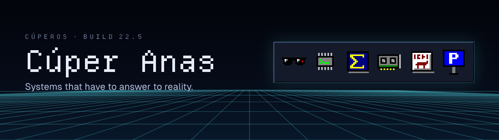

I build systems that have to answer to reality: agents that stop before they fabricate, tools that keep humans in the loop, and experiments where the edge cases are the point.

Right now that means AI agents, formal verification, product-shaped tools, systems-and-physics modeling, and the awkward but important question of when automation should refuse to act.

**[cuuper22.pages.dev](https://cuuper22.pages.dev)** is my portfolio: a retro×futuristic desktop where the projects run live. ToaruOS-Arnold boots in your browser, Erdos replays a solve, and there's a DOS prompt if you'd rather type. In a hurry? **[Quick read](https://cuuper22.pages.dev/read/)** has everything on one plain page.

## Pinned

| | |
|---|---|
| [**ToaruOS-Arnold**](https://github.com/Cuuper22/ToaruOS-Arnold) · [boot it](https://cuuper22.pages.dev/?open=toaruos-arnold) | A windowed x86 desktop OS with its own TCP/IP stack. About 22,000 lines of ArnoldC, where every keyword is an Arnold Schwarzenegger quote. |
| [**ArnoldC-Native**](https://github.com/Cuuper22/ArnoldC-Native) · [try it](https://cuuper22.pages.dev/?open=arnoldc-native) | The compiler that made that possible: a Scala fork with native x86, freestanding C, and kernel backends, plus about 90 new keywords for systems work. |
| [**Erdos**](https://github.com/Cuuper22/Erdos) · [replay](https://cuuper22.pages.dev/?open=erdos) | A Lean 4 Prover/Critic loop that caught its own AI cheating at math. SHA-256 theorem locking, sanitized feedback, 342 tests. |
| [**gpu_stack**](https://github.com/Cuuper22/gpu_stack-) · [trace a path](https://cuuper22.pages.dev/?open=gpu-stack) | GPU training as one SymPy equation graph, from the cost of a token down to the speed of light, with the unknowns left visible. |
| [**IVC**](https://github.com/Cuuper22/ivc) · [see the ledger](https://cuuper22.pages.dev/?open=ivc) | Indus script research built to make overclaiming structurally hard. One accepted structural finding. Zero readings, on purpose. |
| [**CurbRun**](https://github.com/Cuuper22/curbrun) · [try it](https://cuuper22.pages.dev/?open=curbrun) | Android app that finds legal, free curb parking in San Francisco for the next N hours, from 21,268 SFMTA curb rules. |

Also built: [PhysicsLab](https://github.com/Cuuper22/PhysicsLab) (a phone as a physics instrument, 35 experiments), [Manim Director](https://github.com/Cuuper22/Manim-plugin) (a coding-agent toolchain for math animation), [codex-canmore](https://github.com/Cuuper22/codex-canmore), [Waypoint](https://github.com/Cuuper22/waypoint-differentiation-lab), [claude-sfx](https://github.com/Cuuper22/claude-sfx), [agent-rate-forecast](https://github.com/Cuuper22/agent-rate-forecast), and [the portfolio itself](https://github.com/Cuuper22/cuuper22.github.io).

## How to inspect

- **Systems depth:** `ToaruOS-Arnold`, `ArnoldC-Native`, `gpu_stack`.
- **Evidence discipline:** `Erdos`, `ivc`.
- **Product judgment:** `curbrun`, `PhysicsLab`, `waypoint-differentiation-lab`.
- **Tooling taste:** `Manim-plugin`, `codex-canmore`, `claude-sfx`, `agent-rate-forecast`.

The pattern I care about is not "I used framework X." It is whether the project has a real constraint, a clear boundary, and enough engineering taste that someone else can pick it up without decoding my entire brain first.

## What I optimize for

- Build the thing far enough that the hard boundary shows up.
- Make the human hand-off explicit: what the system can decide, what it must surface, and where it should stop.
- Prefer projects with an audit trail: tests, artifacts, screenshots, runbooks, or at least enough structure that a reviewer can verify the claim.
- Write READMEs as inspection guides, not trophy cases.

## Background

AI and physics coursework at Minerva University. Taught ML/AI to 250+ students at iD Tech. Fine-tuned multilingual LLMs for a mental-health chatbot at Findhope. Ranked 5th nationally in Egypt.

[Portfolio](https://cuuper22.pages.dev) · [Quick read](https://cuuper22.pages.dev/read/) · [LinkedIn](https://linkedin.com/in/yousefanas) · [Email](mailto:cuuper225@gmail.com)
